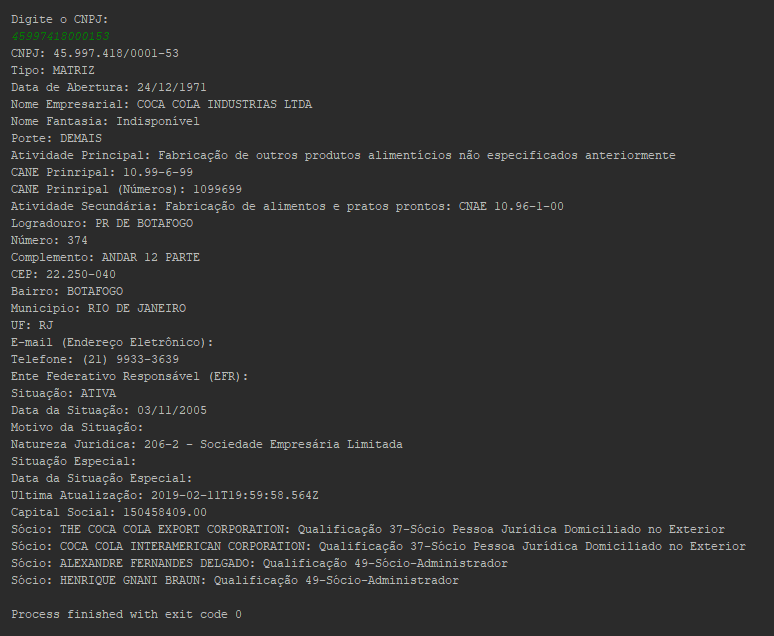

Package para consulta das informações do CNPJ (https://receitaws.com.br/).



## Uso

Um simples exemplo de uso:

```dart
import 'receitaws.dart' as ws;
import 'dart:io';

main() async {
  var cnpj = new ws.receitaws();

  print('Digite o CNPJ: ');

  String lido = stdin.readLineSync();

  var result = await cnpj.searchCNPJ(lido, null);

  // Sucesso
  if (cnpj.getResponse() == 200) {
    print('CNPJ: '+cnpj.getCNPJ());
    print('Tipo: '+cnpj.getTipo());
    print('Data de Abertura: '+cnpj.getAbertura());
    print('Nome Empresarial: '+cnpj.getNome());
    print('Nome Fantasia: '+cnpj.getFantasia());
    print('Porte: '+cnpj.getPorte());
    print('Atividade Principal: '+cnpj.getAtividadePrincipal());
    print('CANE Prinripal: '+cnpj.getCNAEPrincipal());
    print('CANE Prinripal (Números): '+cnpj.getCNAEPrincipalNumeros().toString());

    Map<String, String> sec = new Map<String, String>();

    sec = cnpj.getAtividadesSecundarias();

    sec.forEach((v1,v2) => print('Atividade Secundária: ${v1}: CNAE ${v2}'));

    print('Logradouro: '+cnpj.getLogradouro());
    print('Número: '+cnpj.getNumero());
    print('Complemento: '+cnpj.getComplemento());
    print('CEP: '+cnpj.getCEP());
    print('Bairro: '+cnpj.getBairro());
    print('Municipio: '+cnpj.getMunicipio());
    print('UF: '+cnpj.getUF());
    print('E-mail (Endereço Eletrônico): '+cnpj.getEmail());
    print('Telefone: '+cnpj.getTelefone());
    print('Ente Federativo Responsável (EFR): '+cnpj.getEFR());
    print('Situação: '+cnpj.getSituacao());
    print('Data da Situação: '+cnpj.getDataSituacao());
    print('Motivo da Situação: '+cnpj.getMotivoSituacao());
    print('Natureza Juridica: '+cnpj.getNaturezaJuridica());
    print('Situação Especial: '+cnpj.getSituacaoEspecial());
    print('Data da Situação Especial: '+cnpj.getDataSituacaoEspecial());

    print('Ultima Atualização: '+cnpj.getUltimaAtualizacao());

    print('Capital Social: '+cnpj.getCapitalSocial());

    Map<String, String> qsa = new Map<String, String>();

    qsa = cnpj.getQSA();

    qsa.forEach((v1,v2) => print('Sócio: ${v1}: Qualificação ${v2}'));

  } else {
    print('Código de Retorno: '+cnpj.getResponse().toString());
    print('Erro: '+cnpj.getBody());
  }
}
```

## Recursos

ReadIP - Método que realiza a consulta da localização do IP Externo.

gets

    getBody(); // Retorna na integralidade a resposta da API.
    getResponse(); // Retorna o código da consulta a API (Padrão 200 para sucesso).
    
    Quando houver sucesso (código 200) os métodos abaixo trazem retorno, do contrário retornam null;
    
    getCNPJ(); // Recupera o CNPJ da Empresa.
    getTipo(); // Recupera o Tipo da Empresa (Matriz/Filial).
    getAbertura(); // Recupera a Data da Abertura da Empresa.
    getNome(); // Recupera o Nome Empresarial da Empresa.
    getFantasia(); // Recupera o Nome Fantasia da Empresa.
    getPorte(); // Recupera o Porte da Empresa.
    getAtividadePrincipal(); // Recupera o Ramo de Atividade Principal da Empresa.
    getCNAEPrincipal(); // Recupera o CNAE Principal da Empresa.
    getCNAEPrincipalNumeros(); // Recupera o CNAE Principal (em números) da Empresa.
    getLogradouro(); // Recupera o Logradouro do endereço da Empresa.
    getNumero()(); // Recupera o Número do endereço da Empresa.
    getComplemento(); // Recupera o Complemento do endereço da Empresa.    
    getCEP(); // Recupera o CEP do endereço da Empresa.
    getBairro(); // Recupera o Bairro do endereço da Empresa.
    getUF(); // Recupera o Estado do endereço da Empresa.
    getEmail(); // Recupera o e-mail da Empresa.
    getTelefone(); // Recupera o telefone da Empresa.
    getEFR(); // Recupera o EFR (Ente Federativo Responsável) da Empresa.
    getSituacao(); // Recupera a Situação do cadastro CNPJ da Empresa.
    getDataSituacao(); // Recupera a data da Situação do cadastro do CNPJ da Empresa.
    getMotivoSituacao(); // Recupera o motivo situação da Empresa.
    getNaturezaJuridica(); // Recupera a Natureza Juridica da Empresa.
    getSituacaoEspecial(); // Recupera a data da situação especial da Empresa.
    getUltimaAtualizacao(); // Recupera a data da última atualização do registro junto a SEFAZ.         
    
## Funcionalidades e Bugs

Por favor para requisições de funcionalidades e bugs [issue tracker][tracker].

[tracker]: https://github.com/mateuspenha/receita_ws/issues